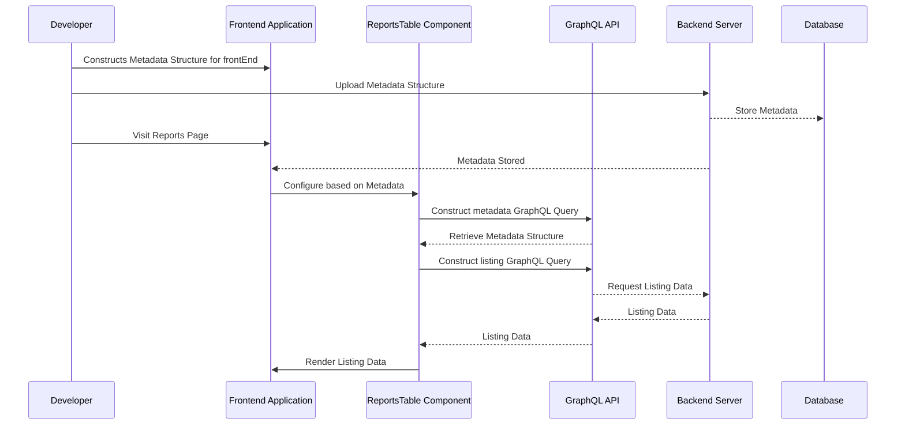
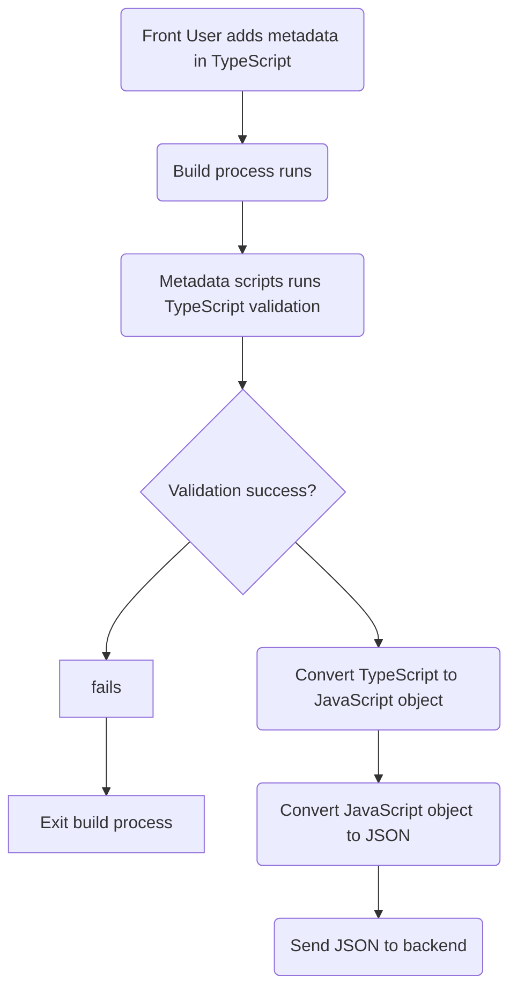

# How to write metadata for reports framework:
<details><summary><b>Overview</b></summary>

## Working of framework:
The Reports framework adopts the GraphQL API architecture. This framework utilizes the ReportsTable component as a universal component for rendering across all GraphQL APIs. Here's how it functions:

The following diagram outlines the process of adding metadata, rendering reports, configuring the frontend component, and retrieving data for display.


1.Adding MetaData: A frontend user constructs a metadata structure. Each structure is assigned a unique key to identify the report. This metadata structure is then uploaded to the backend and stored in the database.

2.Rendering Process: When a user visits the reports page, the unique report ID from the URL is used to construct a metadata query. This query is sent to the GraphQL API, which retrieves the corresponding metadata structure stored in the backend.

3.Configuration: Based on the received metadata structure, the frontend ReportsTable component is configured for rendering.

4.Data Retrieval: The metadata structure is parsed to construct the query required for calling the GraphQL API to fetch listing data. This listing data, containing the reports' information, is rendered through the ReportsTable component, which internally utilizes the react-data-table-v8 library for rendering.

In summary, two APIs are called in this process:

The first API retrieves the metadata.
Based on the metadata, the second API is called to retrieve the listing data.
The metadata contains the necessary data for constructing the query and some UI-related data, while the listing data contains the actual reports' information, which is displayed in the table.
</details>
<details>
  <summary><b>Data Structure of metadata</b></summary>
	
## MetaData properties and structure:
The TypeScript interface collection defined below is the structure for building dynamic tables with customizable cells, filters, and properties. It provides a comprehensive framework for managing and displaying tabular data in web applications.

### Main Typescript Structure

- **ReportsTable**: Represents the main typescript structure for defining a dynamic table, including keys, query parameters, page properties, column definitions,filter properties and table properties.

These interfaces enable developers to create flexible and interactive tables that meet diverse application requirements, enhancing user experience and data visualization capabilities.
Other than the report data itself, everything related to the report is contained in the metadata. So metadata is queried first using the unique id provided from the URL.
```typescript
export type ReportsTable = {
  key: string;
  query_keys: string[];
  table_version: string;
  filter_props?: FilterProp[];
  page_props: PageProps;
  column_defs: ColumnDef[];
  table_props: TableProps;
};

interface CustomCellProperties {
  [key: string]: any;
  imageProperties?: {
    imageWidth?: number;
    imageHeight?: number;
    objectFit?: string;
    imageBorderEnabled?: boolean;
  };
  badgeProperties?: {
    badgeAccessor: string;
    badgeText?: string;
    variant?: string;
    badgeShape?: string;
    badgeSize?: string;
    badgeColor?: string;
  };
}
interface DropDownOption {
  label: string;
  value: string | number | boolean;
}

interface EntityMapping {
  value: string;
  entity: string;
  relates_to: string[];
}
interface DynamicFilter {
  enum?: boolean;
  field?: string;
  key?: string;
  default?: boolean;
  fieldLabel?: string;
  dropDownOptions?: DropDownOption[];
  fieldType?: string;
  dependentAttributes?: { [key: string]: any };
}

interface ColumnDef {
  size?: number;
  header: string;
  hide?: boolean;
  suffix?:string;
  accessorKey: string;
  customCell?: string;
  dependentDataKeys?: {
    [key: string]: {
      [key: string]: string
    } | string;
  };
  customCellProperties?: CustomCellProperties;
  enableSorting?: boolean;
  isSortable?: boolean;
  disableSortBy?: boolean;
  columns?: {
    header: string;
    accessorKey: string;
  }[];
}
interface Links {
  url?: string;
  generateLink?: { [key: string]: any };
  params?: {
    [key: string]: string | object;
  };
  routeParams?: {
    [key: string]: string | object;
  };
  encodeRouteParams?: boolean;
  sendCurrentParams?: boolean;
}

interface TableProps {
  rowItemHeight?: number;
  disableTableActionBar?: boolean;
  searchLabel?: string;
  searchField?: string;
  isExportEnabled?: boolean;
  keysToExcludeInExport?: string[];
  isMessageSendingEnabled?: boolean;
  disableSelectColumns?: boolean;
  personalization_details?: PersonalizationDetails; // for sending email
  deleteFromSelectColumn?: string[]; // by default checkboxes from select column which you don't want to show
  optionalFields?: string[]; // by default hidden checkboxes
  customActionButton?: string | string[];
  customPageSize?: number;
  enableCreateGroup?: boolean;
  disablePagination?: boolean;
  fetchPolicy?: string;
  links?: Links | null;
  reorderKey?: string;
  selectedRowType?:string;
  disableSearchAndFilter?: boolean;
  exportVariables?: { [key: string]: string };
  disableSelectedRowsCount?:boolean;
}
interface Module {
  title: string;
  href: string;
  params?: { [key: string]: string };
}

interface Breadcrumbs {
  modules: Module[];
}

interface ModalActionsButton {
  buttons: any[];
}
interface HiddenVariables {
  [key: string]: string;
}

interface VariableMappings {
  [key: string]: string;
}

interface TestVariables {
  [key: string]: string;
}

interface PersonalizationDetails {
  hidden_variables?: HiddenVariables;
  variable_mappings?: VariableMappings;
  test_variables?: TestVariables;
  entity_mappings?: EntityMapping[];
}

interface ParamList {
  [key: string]: string;
}

interface Settings {
  title: string;
  link: string;
  icon?: string;
  color?: string;
  showLinkInNewTab?: boolean;
  mainParam?: string;
  paramList?: ParamList;
  overLayScreenMetaDataId?: string;
}
interface TabLink {
  tabLink: string;
  tabName: string;
  id?: string;
  tabQueryParamsKey?: string[];
  tabQueryParamsObject?: {};
}
interface MenuItem {
  text: string;
  onClick?: string;
  icon?: string; // Optional property
  param?: string;
  mutationKey?: string;
  mutationType?: string;
}

interface MoreOptions {
  title: string;
  menuList: MenuItem[];
}

interface KPIQueryParameter {
  paramName: string;
  paramKey: string;
}

interface KPIComponentData {
  dashboardKPI?: boolean;
  disableTableKPI?: boolean;
  KPIComponentKey: string;
  KPIComponentName: string;
  KPIQueryFields: string[];
  KPIqueryParams: KPIQueryParameter[];
}

interface BannerDetails {
  bannerText: string;
  icon?: string;
  showIconBackground?: boolean;
}
interface FilterItem {
  field: string;
  operator: string;
  value: string;
}

interface EmptyMessageDetails {
  message: string;
  imageName?: string;
}
interface Filters {
  operations: { groupName: string };
  filterItems: FilterItem[];
}

interface BannerDetials {
  bannerText: string;
  icon?: string;
  showIconBackground?: boolean;
}
interface EmptyScreenParams {
  title: string;
  description?: string;
  illustration?: string;
  buttonText?: string;
  link?: string;
}

interface PageProps {
  description?: string;
  heading?: string;
  breadcrumbs?: Breadcrumbs;
  dynamicBreadcrumbs?: Breadcrumbs;
  dateFilterBy?: string;
  disableFilters?: boolean;
  disableSelectColumns?: boolean;
  disableBreadcrumbs?: boolean;
  useLocalBreadcrumbs?: boolean;
  modalActionsButton?: ModalActionsButton;
  disableHeader?: boolean;
  showTotalRecordCount?: boolean;
  isSelectAllRowEnabled?: boolean;
  enableLocalStorageForFilters?: boolean;
  storageName?: string;
  helpDescription?: string;
  settings?: Settings;
  create?: Settings;
  currentTab?: string;
  tabLinks?: TabLink[];
  tabQueryParamsKey?: boolean;
  tabFilterId?: string;
  tabQueryParamsObject?: boolean;
  moreOptions?: MoreOptions;
  disableDateFilter?: boolean;
  disableSearchAndFilter?: boolean;
  listType?: string;
  isBeta?: boolean;
  KPIComponentData?: KPIComponentData;
  fetchPolicy?: string;
  backNavigationUrl?: string;
  disableTableActionBar?: boolean;
  emptyScreenParams?: EmptyScreenParams;
  navbarTagProps?: {
    schoolConfigKey: string;
    navbarTagText: string;
  };
  bannerDetails?: BannerDetails;
  emptyMessageDetails?: EmptyMessageDetails;
}
interface FilterProp {
  header: string;
  accessorKey: string;
  filterType: string;
  dynamicFilter?: DynamicFilter;
}
```
## Interfaces Overview

- **PageProps**: Specifies properties for configuring the overall page layout and functionality.
- **filterProps**: Specifies properties for configuring the filters in for the table.
- **ColumnDef**: Defines the structure of columns in the table, including custom cells and sorting options.
- **TableProps**: Specifies properties for configuring the table layout and behavior.
- **CustomCellProperties**: Defines additional properties that can be added to customize table cells.
- **DropDownOption**: Represents options for dropdown menus.
- **DynamicFilter**: Specifies properties for dynamic filtering of table data.
- **Breadcrumbs**: Represents breadcrumb navigation for contextual information.
- **HiddenVariables**: Specifies hidden variables used in personalization.
- **VariableMappings**: Defines mappings for variables used in personalization.
- **TestVariables**: Specifies test variables for personalization testing.
- **PersonalizationDetails**: Provides details for personalizing table data.

### Example dummy data:

```typescript
const courseProgressReport: ReportsTable = {
    table_version:"v2",
    key: "courseProgressReport",
    query_keys: [
      "id", 
      "title",
      "imageUrl",
      "lessonCount",
      "courseStat.courseDuration",
      "totalLearners",
      "signupType",
      "publishedAt"
    ],
    page_props: {
     
      dateFilterBy: "Published At",
      helpDescription: "Analyse progress report for courses",
      description: "Select course to view learner progress",
      heading: "Course Progress"
    },
    filter_props:[
      {
      header: "Title",
      accessorKey: "title",
      filterType: "TEXT"
      },
      {
        accessorKey: "lessonCount",
        header: "Lesson Count",
        filterType: "NUMBER"
      },
      { accessorKey: "signupType",
      header: "Permission",
      filterType: "DYNAMIC",
      dynamicFilter: {
        enum: true,
        field: "SIGNUP_TYPE",
        key: "CourseEnums"
      }

      }
    ],
    column_defs: [
      {
        size: 550,
        header: "Title",
        accessorKey: "title",
        customCell: "ImageTitleCell",
        dependentDataKeys: {
          imageAccessorKey: "imageUrl"
        },
        customCellProperties: {
          imageProperties: {
            imageWidth: 100,
            imageHeight: 56
          }
        },
      },
      {
        accessorKey: "lessonCount",
        header: "Lesson Count",
        enableSorting: true
      },
      {
        accessorKey: "courseStat.courseDuration",
        header: "Duration",
        customCell: "DurationCell"
      },
      {
        accessorKey: "totalLearners",
        header: "Learners",
        enableSorting: true
      },
      {
        accessorKey: "signupType",
        header: "Permission",
        customCell: "PermissionTypeCell",
      },
      {
        accessorKey: "publishedAt",
        header: "Published At",
        customCell: "DateCell",
        enableSorting: true
      }
    ],
    table_props: {
      rowItemHeight: 100,
      customPageSize: 10,
      searchField: "title",
      isExportEnabled: true,
      links: {
        url: "/admin-v3/reports-table?id=userProgressReport",
        params: {
          productId: "var_id",
          customTitle: "var_title",
          createGroup: "var_createGroup",
          createGroupCategory: "var_createGroupCategory"
        }
      }
    }
  };

```
### TypeScript Compilation and Data Updation in Backend:




### Updating Metadata from localhost:

Report metadata is queried using the key from the metadata. The report id in the URL is used as the metadata key while querying for the metadata. This key is exactly the name of the graphql query provided from the backend. This makes each report have unique metadata.

To add/edit a report metadata in the database the following API is used:

```json
API: https://api.learnyst.com/learnyst/meta_data
```

JSON Data:
```json
{
  "api_key": "66226d18be75049746e806ee4f9a9531", // api_key constant, required in the API
  "table_version": "v2",
  "key": "courseProgressReport",
  "query_keys": [
    "id",
    "title",
    "publishedAt"
  ],
  "page_props": {
    "searchField": "title",
    "heading": "Course Progress"
  },
  "column_defs": [
    {
      "size": 550,
      "header": "Title",
      "accessorKey": "title",
      "customCell": "ImageTitleCell",
      "dependentDataKeys": {
        "imageAccessorKey": "imageUrl"
      },
      "customCellProperties": {
        "imageProperties": {
          "imageWidth": 100,
          "imageHeight": 56
        }
      },
      "filterType": "TEXT"
    },
    {
      "accessorKey": "publishedAt",
      "header": "Published At",
      "customCell": "DateCell",
      "enableSorting": true
    }
  ],
  "table_props": {
    "rowItemHeight": 100,
    "customPageSize": 10,
    "links": {
      "url": "/admin-v3/reports-table?id=userProgressReport",
      "params": {
        "createGroupCategory": "var_createGroupCategory"
      }
    }
  }
}
```
## Query

All the table data queries are generated through the **getTableQuery** query generator. It is called initially, based on the metadata received. After the initial fetch, if there are any modifications in the query such as pagination, filters, etc., they are also processed through **getTableQuery**. The resulting query is then used by the Apollo hook.

```typescript
getTableQuery = (
  moduleKey: string,
  fields: string[],
  pageSize: number,
  args?: { [key: string]: number | string },
  isBefore?: Boolean, // used for querying previous page
  filters?: { [key: string]: number | string | .. }
) => {
	...
  const GET_COLUMN_DATA = gql`...`;
	...
};
```
## Table Data

Once Metadata is fetched and ready, table data is queried with dynamic query generator. Column defs describe each column of the report and the accessor property in it is exactly the field that should be queried to get the data for that particular column. Accessors can not be duplicated.

## URL params support

URL params are used to represent the state of the page that the user is viewing.

States which represent major changes in the data of the page, need to be preserved in the URL. Minor states are not required to be kept in the URL, E.g. value entered in the search bar without applying, Modal opened by an action clicked in the table.

States supported with URL are:

- Pagination
- Filters
- Nested breadcrumbs
- Search
- rows per page

## Adding a report (frontend)

To add a new report

1. Check the design
2. Get the metadata heading, description, columns, links
3. Refer metadata structure for defining
4. Update metadata in the backend
5. Add the link in UI

</details>
<details>


   <summary><b>Construction rules for metaData</b></summary>
   
### Metadata inside columndefs example:
```json
{
      "header": "Email",
      "accessorKey": "email",
      "dependentDataKeys": {
        "imageAccessorKey": "profilePhotoFileName",
        "isVerified": "confirmedAt"
      },
      "size": 380,
      "customCell": "EmailCell",
      "customCellProperties": {
        "showVerification": true
      }   
}
```
## Header Rule

- **Data Type:** String
- **Description:** Specifies the header title of the column.
- **Acceptable Values:** Any valid string representing the column header.

## Accessor Rule

- **Data Type:** String
- **Description:** Specifies the accessor used to retrieve data for the column from the dataset.
- **Acceptable Values:** Any valid string representing the accessor key for accessing data in the dataset.

## Custom Cell Properties Rule

- **Data Type:** Object
- **Description:** Contains additional properties specific to custom cell rendering.
- **Structure:** Variable based on the specific custom cell component used.
- **Acceptable Values:** Any key-value pairs required by the custom cell component,the valueKey should  be from the api which will be added to display additional data in the custom cell .

## Custom Cell Rule

- **Data Type:** String
- **Description:** Specifies the custom cell renderer used for rendering the content of the column.
- **Acceptable Values:** Any valid string representing the reference to a custom cell component.

## Dependent Data Keys Rule

- **Data Type:** Object
- **Description:** Contains additional keys related to the email cell.
- **Structure:** Variable based on the specific requirements of the custom cell component used.
- **Acceptable Values:** Any key-value pairs required by the custom cell component to retrieve dependent data.

## Size Rule

- **Data Type:** Number
- **Description:** Specifies the width of the column in pixels.
- **Acceptable Values:** Any valid positive integer representing the width of the column in pixels.

</details>


<details>
   <summary><b>Standard custom cells which are allowed to be used:</b></summary>


# Standard learnyst Custom Cell

## Why Standard Learnyst Custom Cell?

Custom cells offer the flexibility to process and format data before displaying it in a table cell. This is particularly useful when certain columns require special handling or rendering based on specific requirements.

- **Scalability and Resource Management**: While restricting custom cells to a defined set, the architecture remains scalable to accommodate future growth. This approach optimizes resource allocation for development, testing, and documentation, ensuring efficient project management and scalability.

- **Flexibility and Maintainability**: Despite the limitations, developers maintain flexibility to address diverse requirements. This promotes code reusability, modularity, and adherence to design standards, facilitating easier maintenance and onboarding of new contributors.


**Usage**

Custom cells are implemented within the "reports molecules" section of the application. All custom cell components are exported through the "LearnystCellRenderers.tsx" file.

To utilize a custom cell for a column in the table, you need to specify the "customCell" property with the custom cell renderer as its value.

When the "customCell" property is defined for a column, the column parser identifies and maps the corresponding custom cell component for rendering.

# Writing MetaData for CustomCell Logic
When working with React Table and custom cell components, it's essential to properly define the metaData structure to configure the table columns. This documentation provides guidelines on how to write metaData to utilize the custom cell logic effectively.

MetaData defines the configuration for each column in your React Table, including accessor keys, custom cell components, and any additional properties required for customization.

## DateCell
### Purpose:
The DateCell component renders the  date using the specified date format type.

To utilize the DateCell logic within your React Table, follow these steps to define the metaData structure:          

 **Custom Cell**: Specify the custom cell component as "DateCell" to utilize the DateCell logic for rendering the date.

 **Custom Cell Properties**: Optionally, provide custom properties such as `dateFormatType` to customize the date format.

 ### Supported `dateFormatType`

The DateCell component supports the following `dateFormatType` values:

- **ShortDate**: Formats the date as a short date (e.g., "Jan 1, 2022").
- **ExpiryDate**: Formats the date along with a suffix, typically used for displaying expiry dates.
- **RelativeDate**: Formats the date as a relative time ago (e.g., "2 days ago").
- **DateAndTime**: Formats the date with both date and time (e.g., "Jan 1, 2022 • 12:00 PM").

### Example MetaData

```json
{
  "accessorKey": "createdAt",
  "header": "Exported On",
  "customCell": "DateCell",
  "customCellProperties": {
    "dateFormatType": "RelativeDate"
  }
}
```
## EmailCell

### Purpose: 
The EmailCell component renders the email address along with the avatar if provided. It also displays a verification icon and tooltip if the isShowVerifiedEnabled property is set to true.

To utilize the EmailCell logic within your React Table, follow these steps to define the metaData structure:

**Custom Cell**: Specify the custom cell component as "EmailCell" to utilize the EmailCell logic for rendering the email.

**Custom Cell Properties**: Optionally, provide custom properties such as `isShowVerifiedEnabled` and `avatarProperties` to customize the email cell.

### Supported Custom Cell Properties

The EmailCell component supports the following custom cell properties:

- **showVerification**: Specifies whether to show verification status.
- **dependentDataKeys**: Specifies section of the metadata which defines keys that are used to access additional data related to the email being displayed in the cell.

### Example MetaData

```json
{
      "header": "Email",
      "accessorKey": "email",
      "dependentDataKeys": {
        "imageAccessorKey": "profilePhotoFileName",
        "isVerified": "confirmedAt"
      },
      "size": 380,
      "customCell": "EmailCell",
      "customCellProperties": {
        "showVerification": true
      }   
}
```
## MobileVerifyStatusCell
### Purpose:
The MobileVerifyStatusCell component renders the mobile number along with the verification status icon if the mobile number is not verified.

To utilize the MobileVerifyStatusCell logic within your React Table, follow these steps to define the metaData structure:

**Custom Cell**: Specify the custom cell component as "MobileVerifyStatusCell" to utilize the MobileVerifyStatusCell logic for rendering.

**Custom Cell Properties**: No custom cell properties are required for this cell.

### Note

**Note:** If `isShowVerifiedEnabled` is set to true, the `accessor` property should provide access to both the mobile number and verification status. For example, `"accessor": "mobile/isMobVerified"` accesses both mobile number and verification status.


### Example MetaData

```json
{
  "header": "Mobile",
  "accessorKey": "mobile",
  "dependentDataKeys:{
  "mobileVerificationStatus":"isMobVerified"
   }
  "customCell": "MobileVerifyStatusCell",
  "customCellProperties": {
   "showVerification": true
  }   
  "filterType": "TEXT",
  "size": 250
}
```
## TagorTextCell

### Purpose: 
The TagCell component renders tags based on the status values. It uses the valueColorMap to determine the color of the tag and the valueTagTextMap to determine the text to display on the tag.

To utilize the TagCell logic within your React Table, follow these steps to define the metaData structure:

**Custom Cell**: Specify the custom cell component as "TagCell" to utilize the TagCell logic for rendering.

**Custom Cell Properties**: Optionally, provide custom properties such as `valueColorMap` and `valueTagTextMap` to customize the appearance and text of the tags.

### Supported Custom  Properties

The Tag component supports the following custom  properties:

- **valueColorMap**: Specifies the color of the tag to be shown based on the status mentioned.
- **valueTagTextMap**: To customize the text view on the tag as per status.

### Example MetaData

```json
{
  "accessorKey": "userQuiz.status",
  "header": "Status",
  "customCell": "TagOrTextCell",
  "valueColorMap": {
    "4": "error",
    "2": "success",
    "0": "basic",
    "3": "basic",
    "1": "accent"
  },
  "customCellProperties": {
    "valueTagTextMap": {
      "0": "Not Started",
      "1": "Started",
      "2": "Submitted",
      "3": "Time exceeded",
      "4": "Submitted after time exceeded"
    }
  }
}
```
if text is needed instead of Tag then pass "type":"text"
```json
{
  "accessorKey": "userQuiz.status",
  "header": "Status",
  "customCell": "TagOrTextCell",
  "valueColorMap": {
    "4": "error",
    "2": "success",
    "0": "basic",
    "3": "basic",
    "1": "accent"
  },
  "customCellProperties": {
    "type":"text",
    "valueTagTextMap": {
      "0": "Not Started",
      "1": "Started",
      "2": "Submitted",
      "3": "Time exceeded",
      "4": "Submitted after time exceeded"
    }
  }
}
```

## HTMLCell

### Purpose: 
The HTMLCell component is designed to render HTML content within the cell. It provides support for rendering HTML content as plain text with support for line breaks.
To utilize the HTMLCell logic within your React Table, follow these steps to define the metaData structure:

**Custom Cell**: Specify the custom cell component as "HTMLCell" to utilize the HTMLCell logic for rendering.

**Custom Cell Properties**: No custom cell properties are required for this cell.

### Example MetaData

```json
{
  "accessorKey": "qtext",
  "header": "Questions",
  "customCell": "HTMLCell",
  "size": 550
}
```

## DurationCell
## Purpose:
The DurationCell component renders the average time spent data in a formatted duration.

To utilize the DurationCell logic within your React Table, follow these steps to define the metaData structure:

**Custom Cell**: Specify the custom cell component as "DurationCell" to utilize the DurationCell logic for rendering.
**Custom Cell Properties**: No custom cell properties are required for this cell.

### Example MetaData

```json
{
  "accessorKey": "avgTimeSpent",
  "header": "Average Time Spent",
  "customCell": "DurationCell"
}
```
## ActionsPopOverCell Component

### Purpose
The `ActionsPopOverCell` component renders a popover menu with various actions for a specific row in a table.

### Functionality
- Renders a popover menu with action items based on `mutationList`.
- Clicking an action item triggers the corresponding action:
  - Performs a mutation.
  - Opens a redirection link.
- Displays a confirmation modal before executing a mutation action.

### Supported Custom Cell Properties
The `mutationList` array contains objects representing the actions available in the popover menu. Each object defines the properties of a single action item.
- **MutationParams**: 
     - **actionMutationKey**: The api action key name.
     - **actionMutationKey**: The api action type name.
- **actionText**: Text label for the action item.
- **icon**: Icon representing the action item.
- **iconColor**: Color of the icon representing the action item.
- **redirectionLink**: Optional link to redirect the user when the action is clicked.
- **confirmModalHeaderText**: Header text for the confirmation modal when the action is clicked.
- **confirmModalButtonText**: Text for the confirmation button in the modal.
- **confirmModalDescription**: Description text displayed in the confirmation modal.

### Example MetaData
```jsx
{
  "accessorKey": "#",
  "header": "Actions",
  "customCell": "ActionsPopOverCell",
  "customCellProperties": {
    "mutationList": [
      {
        "mutationParams": {
          "actionMutationKey": "updateTemplateSection",
          "actionMutationType": "TemplateSectionUpdateInput"
        },
        "publishStatusKey": "publishStatus",
        "includePublishStatus": true,
        "actionText": "Publish / Unpublish",
        "confirmModalHeaderText": "Publish/Unpublish template ?",
        "confirmModalButtonText": "Yes",
        "icon": "upload"
      }
    ]
  }
}
```
## DefaultCell

### Purpose
The DefaultCell component renders the default value. It supports displaying the default value with different types of interactions such as tooltip, download, and copy.

To utilize the DefaultCell logic within your React Table, follow these steps to define the metaData structure:

**Custom Cell**: Specify the custom cell component as "DefaultCell" to utilize the DefaultCell logic for rendering the default value.

**Custom Cell Properties**: Optionally, provide custom properties such as `type` to define the type of interaction for displaying the default value.

### Supported Custom Cell Properties

The DefaultCell component supports the following custom cell properties:

- **type**: Specifies the type of interaction for displaying the course name. Supported types are:
  - "tooltip": Display the default value with a tooltip.
  - "download": Enable downloading functionality for the default value.
  - "copy": Allow copying the default value to the clipboard.
  - "jsonParser": Displays parsed data if given data in json format
    - Need to specify key and value to render proper data in cell.
  - "customLink": Displays link in the cell
    - Need to specify searchParams and baseLink to construct the link.

### Example MetaData

```json
{
    "header": "Course Name",
    "accessorKey": "lesson.courseTitle",
    "size": "200px",
    "customCell": "DefaultCell",
    "customCellProperties": {
        "type": "Tooltip"
    }
}
{
    "accessorKey": "country",
    "header": "Country",
    "customCellProperties": {
      "type": "jsonParser",
      "jsonObject": {
        "key": "key",
        "value": "value"
      }
    }
}
{
    "accessorKey": "id",
    "header": "Event Registrations",
    "customCellProperties": {
      "type": "customLink",
      "links": {
        "baseLink": "/admin-v3/event-registrations",
        "searchParams": "id=listMarketingEventRegistrations",
        "params": {
          "marketingEventId": "var_id"
        },
        "openInNewTab": true
      }
    },
    "size": 220
}
```
## CustomOperationsCell Component

### Purpose
The `CustomOperationsCell` component calls the custom function and renders content based on the provided custom cell.

### Functionality
- Renders the content based on `functionName` and `customCell`.

### Supported Custom Cell Properties
The developer needs to specify the `functionName` in metadata and define the function in the `customFunctions.ts` file
- **functionName**: function to call.

### Example MetaData
```json
{
    "accessorKey": "commissionReceived",
    "header": "Pending Payout",
    "customCell": "CustomOperationsCell",
    "dependentDataKeys": {
      "commissionReceived": "commissionReceived",
      "totalCommissionEarned": "totalCommissionEarned"
    },
    "customCellProperties": {
      "functionName": "calculatePendingPayout"
    },
    "size": 180
}
```

### Example Usage
```typescript
const calculatePendingPayout: Function = (args) => {
  const { totalCommissionEarned, commissionReceived } = args;
  const valueToShow = parseFloat(totalCommissionEarned) - parseFloat(commissionReceived) || 0;
  return {
    valueToShow,
    customCell: 'CurrencyCell', // by default DefaultCell will be rendered
  };
};
const customFunctions: { [key: string]: Function } = {
  calculatePendingPayout,
};
```

## ActionsCell

### Purpose

The `ActionsCell` component renders a single action or popover menu with multiple actions for a specific row in a table.

### Functionality
- Renders a single action or popover menu with action items based on `actions` array.
- Clicking an action item triggers the corresponding action:
  - Performs a mutation.
  - Opens a redirection link.
  - Opens a overlay modal.
  - Makes a function call
- Displays a confirmation modal before executing a mutation action.

### Supported Custom Cell Properties
The `actions` array contains objects representing the actions available. Each object defines the properties of a single action item.
- **type**: Type of the action to be performed
  - mutation
  - overlay
  - link
  - previewOverlay - for static previews
  - function
- **actionText**: Text label for the action item.
- **iconProperties**: Icon properties to show on the UI.
  - icon: icomoon icons
  - color: TStatus
  - size: number
- **modalProperties**: Modal properties to show on the UI.
  - headerText: Heading text
  - description: Description text
  - primaryButton: 
```
    {
      text: string,
      color: TStatus	
    },
  - secondaryButton: 
    {
      text: string,
      color: TStatus	
    },
```
- **disableActionsOnConditions**: To disable action but it will present in UI
- **conditions**: conditions for disabling actions
- **linkProperties**: Properties for link
  - url: Optional link to redirect the user when the action is clicked.
  - urlKey: If link isn't being provided directly and needs to be accessed from queryKey
  - openInNewTab
- **overlayProperties**: Properties for overlay
  - selectIdOnConditions: optional boolean value if overlay meta data ids are selected based on conditions
  - metaDataIds: Array of objects consisting id and conditions(optional field)
  - ```
    {
      id: string;
      conditions?: TCondition;
    }
    ```
  - inputVariables
    - if no type is present we should give defaultValue
    - if type is ROW_DATA variable will be taken from that row data by using given key (original)
    - if type is ROUTE_DATA variable will be taken from that row data by using given key (original)
    ```
    {
      sourceType: 'ROW_DATA' | 'ROUTE_DATA';
      keyName: string;
      keyValue: string;
      defaultValue?: string;
      dataType?: 'NUMBER' | 'NUMBER_ARRAY';
    }
    ```
- **mutationProperties**: Properties for mutation
  - mutationKey
  - mutationType
  - inputVariables
    - if no type is present we should give defaultValue
    - if type is ROW_DATA variable will be taken from that row data by using given key (original)
    - if type is ROUTE_DATA variable will be taken from that row data by using given key (original)
    ```
    {
      sourceType: 'ROW_DATA' | 'ROUTE_DATA';
      keyName: string;
      keyValue: string;
      defaultValue?: string;
      dataType?: 'NUMBER' | 'NUMBER_ARRAY';
    }
    ```
- **previewOverlayProperties**: Properties for preview overlay
  - inputVariables
    - if no type is present we should give defaultValue
    - if type is ROW_DATA variable will be taken from that row data by using given key (original)
    - if type is ROUTE_DATA variable will be taken from that row data by using given key (original)
    ```
    {
      sourceType: 'ROW_DATA' | 'ROUTE_DATA';
      keyName: string;
      keyValue: string;
      defaultValue?: string;
      dataType?: 'NUMBER' | 'NUMBER_ARRAY';
    }
    ```

- **functionProperties**: Properties for function
  - functionName- name of the function that needs to be called
  - functionArguments- arguments that the function is expecting (meta data structure is   same as inputVariables)
  - message- success and failure message which will be displayed after function invocation
  ```
  message: {
    success: string;
    failure: string;
  }
  ```

- **inputVariables** : Input variables present in mutations, overlay and preview overlays
  ```js 
    {
      sourceType?: 'ROW_DATA' | 'ROUTE_DATA';
      keyName: string;
      keyValue: string;
      defaultValue?: string;
      dataType?: 'NUMBER' | 'NUMBER_ARRAY';
    }
  ```
  ```js
    result: 
    inputVariables = {
      [keyName]: ROW_DATA[keyValue],
      [keyName]: dataType(ROUTE_DATA[keyValue]),
      [keyName]: defaultValue
      [keyName]: dataType(defaultValue)
    }
  ```
  - if no type is present we should give defaultValue
  - if type is ROW_DATA variable will be taken from that row data by using given keyName and keyValue
  - if type is ROUTE_DATA variable will be taken from that row data by using given keyName and keyValue
  - if dataType is present it will convert to given dataType

### Example MetaData
```js
    // in listDesignerTemplatePages
    metaDataForActionsCell = {
      accessorKey: '#',
      header: 'Actions',
      customCell: 'ActionsCell',
      dependentDataKeys: {
        pageStatus: 'pageStatus',
      },
      customCellProperties: {
        actions: [
          {
            type: 'mutation',
            actionText: 'Publish',
            mutationProperties: {
              mutationKey: 'updateTemplatePage',
              mutationType: 'TemplatePageUpdateInput',
              inputVariables: [
                {
                  keyName: 'pageStatus',
                  defaultValue: 'published',
                },
                {
                  sourceType: 'ROW_DATA',
                  keyName: 'id',
                  keyValue: 'id',
                }
              ],
            },
            disableActionOnConditions: true,
            conditions: {
              leftOperand: {
                field: 'pageStatus',
                operator: '_eq',
                value: 'published',
              },
            },
            modalProperties: {
              headerText: 'Publish template?',
              description: 'Are you sure want to do this?',
              primaryButton: {
                text: 'Yes',
              },
            },
          },
          {
            type: 'mutation',
            actionText: 'Unpublish',
            mutationProperties: {
              mutationKey: 'updateTemplatePage',
              mutationType: 'TemplatePageUpdateInput',
              inputVariables: [
                {
                  keyName: 'pageStatus',
                  defaultValue: 'published',
                },
                {
                  sourceType: 'ROW_DATA',
                  keyName: 'id',
                  keyValue: 'id',
                }
              ],
            },
            disableActionOnConditions: true,
            conditions: {
              leftOperand: {
                field: 'pageStatus',
                operator: '_eq',
                value: 'unpublished',
              },
            },
            modalProperties: {
              headerText: 'Unpublish template?',
              description: 'Are you sure want to do this?',
              primaryButton: {
                text: 'Yes',
              },
            },
          },
          {
            type: 'link',
            linkProperties: {
              url: 'https://{{websiteDomainV2}}/websites/templates/{{templateId}}/template_pages/{{slug}}',
              openInNewTab: true,
            },
            actionText: 'View Page',
          },
        ],
      },
    },
// in listNavigationMenuItems
    let listNavigationMenuItems = {
      accessorKey: '#',
      header: 'Actions',
      customCell: 'ActionsCell',
      customCellProperties: {
        actions: [
          {
            type: 'overlay',
            actionText: 'Edit',
            iconProperties: {
              icon: 'edit',
            },
            overlayProperties: {
              selectIdOnConditions: true,
              metaDataIds: [
                {
                  conditions: {
                    leftOperand: {
                      field: 'menuItemType',
                      value: 'Link',
                      operator: '_eq',
                    },
                  },
                  id: 'linkMenuItemSettings',
                },
                {
                  conditions: {
                    leftOperand: {
                      field: 'menuItemType',
                      value: 'Product',
                      operator: '_eq',
                    },
                  },
                  id: 'productMenuItemSettings',
                },
                {
                  conditions: {
                    leftOperand: {
                      field: 'menuItemType',
                      value: 'Page',
                      operator: '_eq',
                    },
                  },
                  id: 'pageMenuItemSettings',
                },
              ],
              inputVariables: [
                {
                  sourceType: 'ROW_DATA',
                  keyName: 'id',
                  keyValue: 'id',
                }
              ],
            },
          },
          {
            type: 'mutation',
            actionText: 'Delete',
            mutationProperties: {
              mutationKey: 'deleteNavigationMenuItem',
              mutationType: 'DeleteNavigationMenuItemInput',
              inputVariables: [
                {
                  sourceType: 'ROW_DATA',
                  keyName: 'id',
                  keyValue: 'id'
                },
              ],
            },
            iconProperties: {
              icon: 'trash',
              color: 'error',
            },
            modalProperties: {
              headerText: 'Delete Menu Item?',
              description: 'Are you sure want to do this?',
              primaryButton: {
                text: 'Yes',
              },
            },
          },
        ],
      },
      size: 150,
    },
  
// listBillPackages
 metaDataForActionsCell={
      header: 'Action',
      accessorKey: 'proformaInvoiceUrl',
      customCell: 'ActionsCell',
      customCellProperties: {
        actions: [
         {
            type: 'function',
            functionProperties: {
              functionName: 'onClickCopyToClipBoard',
              functionArguments: [
                {
                  sourceType: 'ROW_DATA',
                  keyName: 'textToCopy',
                  keyValue: 'checkoutUrl',
                }
              ],
              message: {
                success: 'Url Copied Successfully',
                failure: 'Url Copy Failed'
              }
            },
            actionText: 'Copy Payment Url',
            disableActionOnConditions: true,
            conditions: {
              leftOperand: {
                field: 'checkoutUrl',
                operator: '_eq',
                value: null,
              },
            },
          },
        ],
      },
    }
```

</details>

<details>

 <summary><b>Reports Filters</b></summary>

## Admin Reports Filters Integration

Admin reports are integrated with Ransack, which allows applying a range of filters on reports. Ransack supports a list of [search matchers](https://activerecord-hackery.github.io/ransack/getting-started/search-matches/) that are directly supported and can be added to the table data queries.

In the front-end, the [react-filter-control](https://komarovalexander.github.io/ka-table/#/filter-extended) component library is used for adding filters.

### React Filter Control Props

React filter control requires three props to operate:

1. `fields`: List of fields on which filters can be applied, generated by `getFilterFields`.
2. `filterValue`: Current value of the filter, representing all the filters applied, in object format.
3. `onFilterValueChanged`: On change function to update filter value, URL, etc.

### Supported Filters

A column can optionally have one of the supported filter types:

```javascript
FILTER_TYPES = {
  TEXT: 'TEXT',
  NUMBER: 'NUMBER',
  DATE: 'DATE',
};
```

### Supported Search Matchers

Specific operators, known as search matchers, are supported for each filter type. Check the `FILTER_OPERATORS_BY_TYPE` constant in `reportsFilterConstants.ts` to learn more about the supported search matchers for each filter type.

### Configuring Filter for a Table Column 👈

To enable filtering for a specific column, you need to specify the filter type in the column definition. This allows users to apply filters based on the type of data in the UI.

For example, to add a Text filter to the Title field of a report, the column definition would look like this:

```json
{
  "accessor": "categoryName",
  "Header": "Title",
  "filterType": "TEXT"
}
```
### Filter Data

The applied filters from the React filter control are provided in an object format, which is passed through the GraphQL query. The structure of the filter data object is as follows:

```json
{
  "groupName": "and",
  "items": [
    {
      "key": 0,
      "field": "Title",
      "operator": "_cont",
      "value": "Type"
    }
  ]
}
```
the filter object is parsed at the back-end and applied on the data with Ransack.

### URL Support

The applied filters are updated in the URL as query parameters. This means that when a user applies some filters on the report and shares or returns to the same URL, those filters will be automatically applied from the URL.

## Dynamic Filter List

Dynamic filters provide a list of options that can be filtered using the filter query mentioned above. There are two types: Enum and table-based dynamic filters.

### Table-based Dynamic Filters

Data required for listing, which can be chosen to filter data in the table, can be fetched directly from the table. It expects the table name in Ruby as the key and the column name as the field.
For example, a list of categories is required to filter by choosing it.

Query:
```ruby
[
  { 
    field: "id", 
    label_field: "type_name", 
    key: "PostType" 
  }
]
```
Note:
`label_field` is optional. If not provided, it will give the same value for both the value and label in the response.

Query:
```graphql
query {
  dynamicFilterList(field: "id", key: "Category", fieldLabel: "category_name") {
    nodes {
      label
      value
    }
  }
}
```
Response:
```json
{
  "data": {
    "dynamicFilterList": {
      "nodes": [
        {
          "label": "DailyQuiz",
          "value": "2"
        }
      ]
    }
  }
}
```
### Enum Based

This section describes the data required for listing, which can be chosen to filter data in a table. Enums stored in the backend will be provided, expecting a table/class as the key and the enum name as the field.

#### Query:

```graphql
query {
  dynamicFilterList(field: "COURSE_TYPE", key: "CourseEnums") {
    nodes {
      label
      value
    }
  }
}
```
### Response:

```json
{
  "data": {
    "dynamicFilterList": {
      "nodes": [
        {
          "filterValueEnums": "[{label: TEST_COURSE, value: 2},{label: BUNDLE_COURSE, value: 3},]"
        }
      ]
    }
  }
}
```

</details>

<details>
   <summary><b>React Table UI</b></summary>
## UI Components of a Report Page

1. **Breadcrumbs**
2. **Header**
    1. Title
    2. Description
3. **Filters**
    1. Search
    2. Filters
    3. Date Filter
4. **Actions**
    1. Export
    2. Column Selection
5. [**Table**](https://www.notion.so/React-Table-UI-018aacefc1734f31973f73083debcedd?pvs=21)
6. **Pagination**

The report page UI consists of several components to enhance user experience and provide essential functionalities. The following are the key UI components:

### 1. Breadcrumbs
Breadcrumbs provide navigation paths for users to trace their steps back to previous pages or sections.

### 2. Header
The header section typically includes a title and a description to provide context and information about the report.

### 3. Filters
Filters allow users to refine and narrow down the data displayed in the report. This includes search functionality, filter options, and date filtering.

### 4. Actions
Actions provide users with options to perform various tasks related to the report, such as exporting data or selecting columns to display.

### 5. Table
The table component, powered by react-table, offers a flexible and customizable way to present data in tabular format. It supports various features such as sorting, filtering, and pagination.

### 6. Pagination
Pagination controls enable users to navigate through multiple pages of data, ensuring efficient handling of large datasets.

The use of react-table allows for easy integration and customization of the table component, providing a seamless user experience in viewing and interacting with report data.

## Table Features

The table component utilized in this application comes with a wide range of features to enhance usability and flexibility:

#### 1. Custom Cell
Customize individual cells within the table to display content according to specific requirements.

#### 2. Link Support
Support for rendering clickable links within cells, allowing users to navigate to relevant pages or external resources.

#### 3. Virtualization
Virtualization optimizes rendering performance by only rendering the rows that are currently visible on the screen.

#### 4. Pagination
Enable pagination to split large datasets into multiple pages, improving performance and navigation.

#### 5. Column Selection/Hiding
Allow users to choose which columns to display or hide, providing flexibility in viewing data.

#### 6. Column Default Hiding
Set default visibility settings for columns, ensuring consistency in the initial display of data.

#### 7. Column Pinning
Pin columns to the left or right side of the table for easy reference while scrolling horizontally.

#### 8. Column Grouping
Group related columns together to organize and streamline the presentation of data.

#### 9. Sorting
Enable sorting functionality to arrange data in ascending or descending order based on specific column values.

#### 10. Row Drag and Drop
Support drag-and-drop functionality to reorder rows within the table, facilitating intuitive data manipulation.

#### 11. Row Selection
Allow users to select individual rows or multiple rows within the table, enabling actions such as bulk operations or detailed inspection.

#### 12. Date Filter
Provide date filtering options to narrow down data based on specific date ranges or criteria.

#### 13. Filters
Implement various types of filters to refine data displayed in the table, such as text filters, dropdown filters, or custom filters.

#### 14. Search
Incorporate search functionality to quickly find specific data within the table based on keyword queries.

#### 15. Dynamic Breadcrumbs
Generate breadcrumbs dynamically to reflect the user's navigation path within the application, providing context and easy navigation.

#### 16. Custom Title | Description | Column Header
Customize the title, description, and column headers of the table to match the specific needs and branding of the application.

# FEATURES:
### Search

To enable search functionality for a report, you can specify the "searchField" property under the "grid_props" section in the metaData of the specific report.

Example:
```json
"table_props": {
    "searchField": "email",
    "searchLabel":"Email"
}
```


### Dynamic Breadcrumbs

By default, the breadcrumbs structure for reports is:

```json
Dashboard/Reports/[report_heading]
```
Dynamic breadcrumbs offer flexibility for reports that need a different module name than "Reports" or do not require a module name in the breadcrumbs.

To configure dynamic breadcrumbs, specify them as a grid prop in the metadata using the following format:

```json
{
page_props:{
  "breadcrumbs": {
    "modules": [
      {
        "title": "Custom Title",
        "href": "/admin-v3/..."
      }
    ]
  }
}
}

```
### Send Current Params

To pass all the parameters from the current page to the next, set the `sendCurrentParams` property to `true` in the links section of the metadata.

Example:

```json
{
table_props:{
  "links": {
    "url": "/admin/products/pool-question-view",
    "sendCurrentParams": true,
    "routeParams": {
      "questionpoolId": "var_questionPoolId",
      "sectionId": "var_id"
    }
  }
}
}
```
### Make Columns Optional

Pass those accessor keys to optional fields which you do not want to display in the UI and later can be reselected.
```json
"page_props": {
   
    "optionalFields": ["name"],
    "breadcrumbs": {
      "modules": []
    }
```
### Adding Mutations in More Options

Custom Mutation describes how to include custom mutations in the "More" options menu list by specifying the mutation key, mutation type, and parameter name, can be called in moreOptions inside menu list by passing  mutationKey, mutationType and name of the param which we will pass as Id to mutation.

#### Example Configuration

```json
{
page_props:{
"moreOptions": {
  "title": "More",
  "menuList": [
    {
      "text": "Settings",
      "onClick": "/admin-v3/settings?id=questionPoolSettings&page=questionPool&entityId=",
      "icon": "Settings",
      "param": "questionPoolId"
    },
    {
      "text": "Delete Question Pool",
      "icon": "trash",
      "mutationKey": "deleteQuestionPool",
      "mutationType": "DeleteQuestionPoolInput",
      "param": "questionPoolId"
    }
  ]
}
}
}
```
## Setting the Page Size

The default page size for the grid is 10. You can manually set the page size by passing the `customPageSize` property within the `grid_props` object in your configuration. For example, to set the page size to 30, you would include the following in your configuration:

```json
{
  "table_props": {
    "customPageSize": 30
  }
}
```
## Sending ID Parameters with Create and Settings Buttons

You can seamlessly pass an ID or any parameter from the current page to the next through the create and settings buttons in your application. This is achieved by including a `mainParam` field that specifies the name of the parameter to be passed.

Here's how you can configure the `page_props` to pass an ID named `questionPoolId` through both the settings and create buttons:

```json
{
  "page_props": {
    "settings": {
      "title": "Group Questions",
      "link": "/admin/products/groups/pool/list",
      "mainParam": "questionPoolId",
      "icon": "externalLink",
      "sendCurrentParams": true
    },
    "create": {
      "title": "Add Question",
      "link": "/admin/products/pool-questions",
      "mainParam": "questionPoolId"
    }
  }
}
```

## Adding Tabs to Display Multiple Reports on the Same Page

To enhance the user interface by displaying multiple reports within the same page using tabs, you can configure your application's `table_props` to include a `currentTab` for displaying a specific report by default and `tabLinks` for navigating between different reports.

Here's how you can set up the tabs:

```json
{
  "table_props": {
    "currentTab": "/admin-v3/reports-table?id=loginTracker",
    "tabLinks": [
      {
        "tabLink": "/admin-v3/reports-table?id=loginTracker",
        "tabName": "LOGIN TRACKER"
      },
      {
        "tabLink": "/admin-v3/reports-table?id=otpTracker&type=1",
        "tabName": "OTP TRACKER"
      },
      {
        "tabLink": "/admin-v3/reports-table?id=otpLogs&type=2",
        "tabName": "ALL OTP LOGS"
      }
    ]
  }
}
```
## Adding a Custom KPI Component

To integrate a custom Key Performance Indicator (KPI) component into your application that requires separate GraphQL requests, you can configure the `page_props` in your application settings. This allows you to specify the details of the KPI component, including the key, name, query fields, and query parameters needed for the GraphQL requests.

### Configuration Example

```json
{
  "page_props": {
    "KPIComponentData": {
      "KPIComponentKey": "showUserCourse",
      "KPIComponentName": "PlaytimeDurationKpi",
      "KPIQueryFields": ["totalAllocatedPlaytimeCourse", "totalAllocatedPlaytime"],
      "KPIqueryParams": ["userId", "courseId"]
    }
  }
}
```
## Removing Column Headers from Select Columns

In some scenarios, you might want to make specific column headers mandatory, meaning they cannot be deselected by the user from the table's "Select Columns" option. To achieve this, you can specify the accessors for the columns that should always remain visible and cannot be removed by the user. This is configured within the `table_props` of your application settings.

### Configuration Example

```json
{
  "table_props": {
    "deleteFromSelectColumn": ["purchaseMode", "createdAt", "courseType"]
  }
}
```
## Hiding Column Header Fields by Default

For a more streamlined and customizable user experience, you may wish to hide certain column headers by default in your application's table view. These columns remain accessible to users, who can choose to display them via the table's "Select Columns" feature. This functionality is controlled through the `table_props` configuration in your application settings.

### Configuration Example

```json
{
  "table_props": {
    "optionalFields": ["mobile"]
  }
}
```
## Customizing the Date Filter Label

In applications that incorporate data tables with filtering capabilities, providing intuitive and clear filter names is crucial for enhancing user experience. Specifically, for date filters, customizing the label to reflect the type of date information users are filtering by can make the interface more user-friendly and straightforward. This can be achieved by setting a custom name for the date filter in your application's configuration.

### Configuration Example

```json
{
  "page_props": {
    "dateFilterBy": "Purchased On"
  }
}
```
### Enable Create Group

- **Type**: `boolean`
- **Default**: `false`
- **Description**: If set to `true`, enables the creation of groups within the reports table.
- **Example**:
  ```javascript
  table_props:{
    enableCreateGroup: true
  }```
### Disable Pagination

- **Type**: `boolean`
- **Default**: `false`
- **Description**: If set to true, disables pagination in the reports table 
- **Example**:
  ```javascript
  {
    enableCreateGroup: true
  }
# `KPIComponentData` Interface

The `KPIComponentData` interface defines the structure for configuration data related to KPI (Key Performance Indicator) components. Below are the detailed descriptions of each field along with examples.

## Fields and Example Usage

```javascript
page_props:{
 KPIComponentData = {
  // Indicates whether the KPI component is intended to be used in a dashboard.
  // Default: false
  dashboardKPI: true,

  // If set to true, disables the table representation of the KPI component.
  // Default: false
  disableTableKPI: false,

  // A unique key to identify the KPI component.
  KPIComponentKey: "salesKPI",

  // The name of the KPI component.
  KPIComponentName: "Sales Performance",

  // An array of fields that are queried to generate the KPI data.
  KPIQueryFields: ["totalSales", "monthlyGrowth", "yearlyTarget"],

  // An array of query parameters used to fetch the KPI data.
  KPIqueryParams: [
    { param: "startDate", value: "2023-01-01" },
    { param: "endDate", value: "2023-12-31" }
  ]
}
};

</details>
